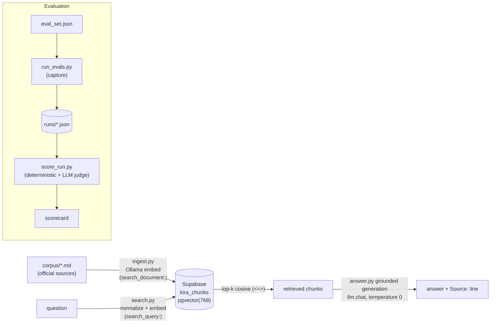

# Kira — Malaysian Statutory Payroll RAG

Kira is a small, dependency-light Retrieval-Augmented Generation (RAG) system that
answers questions about **Malaysian statutory payroll** — EPF (KWSP), SOCSO
(PERKESO), EIS, and PCB (Potongan Cukai Bulanan / Monthly Tax Deduction, LHDNM) —
**strictly from a curated corpus of official sources**.

It is deliberately conservative:

- **Grounded.** Answers use only the retrieved passages; it never draws on the
  model's own knowledge. If the corpus doesn't cover something, it says so.
- **Refuses to compute or advise.** It explains how a scheme works but declines to
  calculate a person's exact figure or give personal tax/financial advice,
  redirecting to the official calculators (LHDN PCB Calculator, KWSP, PERKESO).
- **Cites its sources.** Every answer ends with a `Source:` line naming the
  official document label(s) it actually used.

These properties are enforced by the generation prompt and measured by an
evaluation harness (see [Evaluation](#evaluation)). On the shipped corpus and
config the harness reports **90% retrieval recall@5, a 0% false-refusal rate, and
94% citation correctness** (details below).

---

## Architecture



The pipeline is **chunk → embed → store → retrieve → generate**. Embeddings are
produced locally by Ollama (`nomic-embed-text`, 768-dim) with the model's paired
task prefixes (`search_document:` at ingest, `search_query:` at query) and stored
in Postgres/pgvector on Supabase. Retrieval is cosine similarity via the `<=>`
operator, after light query normalization (see below). Generation and the eval
judge call an LLM through a small multi-backend client (`llm.py`) that speaks
**OpenRouter, Groq, Gemini, or local Ollama** over plain HTTP — no vendor SDKs.

**Query normalization** (in `search.py`, before embedding): a cheap Malay-marker
heuristic detects non-English queries and translates only those to English via one
short LLM call (English queries make no model call); a targeted acronym expansion
maps the Malay `SIP` → `EIS` (which is otherwise almost absent from the corpus).
Generation runs at **temperature 0** for reproducibility.

---

## Repository layout

| Path | What it is |
|------|------------|
| `corpus/` | The knowledge base: `epf.md`, `socso.md`, `eis.md`, `pcb.md`. Each rate/rule is a plain-language paragraph; the first `Source:` line becomes the citation label. |
| `ingest.py` | Reads `corpus/*.md`, splits on blank-line paragraphs, embeds each chunk (Ollama, `search_document:` prefix), and inserts rows into `kira_chunks`. |
| `search.py` | Retrieval only: normalizes the query (conditional translation, acronym expansion), embeds it (`search_query:` prefix), and returns the top-k chunks by pgvector cosine similarity. No generation. |
| `answer.py` | Grounded generation: retrieves, then asks the configured LLM (temperature 0) to answer strictly from the chunks, following the refusal + citation rules. |
| `llm.py` | Multi-backend chat client (`openrouter` / `groq` / `gemini` / `ollama`) with retry, `Retry-After` handling, and per-role config resolution. Shared by generation and the judge. |
| `serve.py` | Local-only FastAPI wrapper (one `POST /ask` endpoint) that calls the committed pipeline as-is and serves the static page. See [Local web client](#local-web-client). |
| `static/index.html` | The single-page web client (plain HTML/CSS/JS, no build step). |
| `evals/eval_set.json` | The fixed evaluation set (43 cases: factual, cross-language, out-of-scope, advice/calculation, adversarial). |
| `evals/run_evals.py` | Runs every case through the pipeline and saves a timestamped, checkpointed run to `evals/runs/`. Capture only — no scoring. |
| `evals/score_run.py` | Scores a saved run: deterministic checks + an LLM-as-judge, and prints a scorecard by type. |
| `scratch/pcb_full.md` | Provenance: the full pre-trim PCB guideline text that `corpus/pcb.md` (concepts-only) was derived from. |
| `.env.example` | Template for all configuration. Copy to `.env` (git-ignored). |

---

## Prerequisites

- **Python 3.10+** with a virtualenv at `.venv`.
- **[Ollama](https://ollama.com)** running locally for embeddings, with the model pulled:
  `ollama pull nomic-embed-text`.
- **Supabase** (or any Postgres) with the **pgvector** extension. `ingest.py` creates
  the extension and `kira_chunks` table for you. Use the **Session pooler** connection
  string (works over IPv4; the direct `db.<ref>.supabase.co` host is IPv6-only).
- An **LLM API key** for generation and the judge. The shipped `.env.example` is
  configured for **[OpenRouter](https://openrouter.ai/keys)** (pay-per-token, so it
  sidesteps free-tier daily caps). **Groq** (free tier), **Gemini**, and local
  **Ollama** chat models are also supported — pick per role via `GEN_BACKEND` /
  `JUDGE_BACKEND`.

---

## Setup

```bash
# 1. Configure
cp .env.example .env          # then fill in the values (see Configuration below)

# 2. Install dependencies
python3 -m venv .venv
./.venv/bin/pip install -r requirements.txt

# 3. Embeddings model
ollama pull nomic-embed-text

# 4. Build the index (creates the extension + table, embeds, inserts)
./.venv/bin/python ingest.py
#   ./.venv/bin/python ingest.py --reset   # re-ingest from scratch
```

> **Re-ingest if you change the embedding config.** The nomic task prefixes
> (`EMBED_TASK_PREFIXES`, on by default) must match on both sides — the stored
> vectors and the query vector — so any change means `ingest.py --reset`.

## Usage

```bash
# Retrieval only — inspect what the retriever returns (with query normalization)
./.venv/bin/python search.py "what is the employer EPF contribution rate?"
./.venv/bin/python search.py "berapa kadar caruman SOCSO majikan?"   # Malay → auto-translated
./.venv/bin/python search.py --no-translate "..."                    # retrieve on the raw query

# Grounded answer (uses GEN_BACKEND; .env.example ships OpenRouter)
./.venv/bin/python answer.py "how much does an employer contribute to EPF?"

# See the prompt without calling the model
./.venv/bin/python answer.py --dry-run "compute my PCB on RM6000 salary"

# Override the backend for one run
GEN_BACKEND=groq ./.venv/bin/python answer.py "..."
```

The two guardrails in action:

- *"What is the SOCSO rate for an employee under 60?"* → states the rates, ends with
  `Source: PERKESO — Contributions`.
- *"Calculate my PCB on RM6,000 with two kids."* → *"I can explain how PCB works, but I
  can't calculate your exact figure…"* and points to the LHDN PCB Calculator.

---

## Local web client

A thin, **localhost-only** web UI over the pipeline — no hosting, no internet exposure.
`serve.py` is a small FastAPI app that calls the *committed* pipeline exactly as-is
(retrieval + grounded generation) and serves a single static page from `static/`.
`fastapi` and `uvicorn` are included in `requirements.txt`.

```bash
# start it (binds to 127.0.0.1 only)
./.venv/bin/uvicorn serve:app --host 127.0.0.1 --port 8000
#   or: ./.venv/bin/python serve.py

# then open http://127.0.0.1:8000
```

**Prerequisites** are the same as the pipeline (it reuses the exact same code): Ollama
running with `nomic-embed-text`, Supabase reachable, and a generation backend
configured in `.env` (OpenRouter by default). Query normalization and the
`search_document:` / `search_query:` prefixes are on; generation runs at temperature 0.

**Endpoint** — `POST /ask` with `{"question": "..."}` returns:
```json
{ "answer": "...", "source": "PERKESO — Contributions",
  "refused": false, "refusal_type": "none|not_covered|advice",
  "model": "openrouter:meta-llama/llama-3.3-70b-instruct",
  "chunks": [{"rank":1,"score":0.94,"scheme":"eis","source_label":"...","snippet":"..."}] }
```

**Scope:** bound to `127.0.0.1` (not reachable from the network); no history, no
settings, no auth. The page makes refusals visually distinct from cited answers, so the
grounding behavior — *not-covered* vs *calculation/advice* refusal vs a normal cited
answer — is visible at a glance.

---

## Configuration

All configuration lives in `.env` (never committed). See `.env.example` for the full,
annotated template. Key variables:

| Variable | Purpose |
|----------|---------|
| `SUPABASE_DB_URL` | Full Postgres connection string (Session pooler URI). Or set the `SUPABASE_DB_HOST/_PORT/_NAME/_USER/_PASSWORD` parts individually. |
| `OLLAMA_URL`, `OLLAMA_MODEL` | Ollama endpoint and embedding model (defaults: `http://localhost:11434`, `nomic-embed-text`). |
| `EMBED_TASK_PREFIXES` | Apply nomic's `search_document:` / `search_query:` prefixes (default on). Change it and you must `ingest.py --reset`. |
| `GEN_BACKEND`, `GEN_MODEL` | Generation backend (`openrouter` \| `groq` \| `gemini` \| `ollama`) and optional model override. |
| `JUDGE_BACKEND`, `JUDGE_MODEL` | Eval-judge backend and optional model override — keep it on a **different** model than generation. |
| `OPENROUTER_API_KEY`, `OPENROUTER_MODEL` | OpenRouter key and default model (`meta-llama/llama-3.3-70b-instruct`). The shipped default backend. |
| `GROQ_API_KEY`, `GROQ_MODEL` | Free-tier Groq key and default model (`llama-3.3-70b-versatile`). |
| `GEMINI_API_KEY`, `GEMINI_MODEL` | Only needed if a backend is set to `gemini`. |
| `TRANSLATE_BACKEND`, `TRANSLATE_MODEL` | Backend/model for the cross-language query translation (defaults to OpenRouter + `openai/gpt-4o-mini`). |

> **Keep generation and the judge on different models.** If both use the same model,
> the judge grades its own output (self-preference bias). The shipped `.env.example`
> puts generation on `meta-llama/llama-3.3-70b-instruct` and the judge on
> `openai/gpt-4o-mini` — one OpenRouter key drives both.

---

## The corpus

Four markdown files, one per scheme, derived from official sources. Each contribution
rate is written as a complete plain-language sentence, each rule/FAQ is its own
blank-line-separated paragraph, and there are no HTML tables. The `scheme` is derived
from the filename; the `source_label` (the short citation shown to users) comes from
the first `Source:` line. The EPF rate rows are deliberately chunked into minimal,
"discriminator-forward" paragraphs so near-identical rows separate cleanly under
retrieval.

`corpus/pcb.md` is intentionally a **concepts-only** rendering: formulas, rate
schedules, and worked calculations were removed because the system explains PCB
concepts and refuses to compute deductions. The untrimmed original is preserved at
`scratch/pcb_full.md` for provenance.

To change the knowledge base, edit `corpus/*.md` and re-run `ingest.py --reset`.

---

## Evaluation

The harness makes the system's behavior measurable and keeps the scorecard
**trustworthy**. It is split into **capture** and **scoring** so generation is run once
and can be scored (and re-scored) without touching the model again.

```bash
# 1. Capture: run every eval case, save a timestamped run under evals/runs/
./.venv/bin/python evals/run_evals.py                 # add --delay 8 to pace free tiers
./.venv/bin/python evals/run_evals.py --resume evals/runs/run_XXXX.json   # continue a partial run

# 2. Score: deterministic checks + LLM judge, printed by type
./.venv/bin/python evals/score_run.py                 # newest run
./.venv/bin/python evals/score_run.py --no-judge      # deterministic only, zero API calls
```

**Deterministic checks (no LLM):** citation correctness (cited `source_label` vs
expected — not chunk indices), forbidden-fact violations, retrieval recall@k (did the
gold chunk appear in top-k), facts-present, refusal correctness, and **false-refusal**
detection. A false refusal — an answerable case the system refused anyway — is owned
entirely by this layer (the judge never sees refusals) and scored 0.

**Refusal detection at two operating points.** Refusals are detected by *intent*
(corpus-miss vs calculation/advice guardrail) via marker sets, not one exact phrase, so
a correctly-paraphrased refusal isn't miscounted. The two consumers have opposite error
costs, so detection runs twice: a **broad, high-recall** classifier drives
refusal-correctness on refusal-*expected* cases (a false positive there can't hide an
answer), while a **strict, high-precision** classifier drives the answer-*attempt*
decision (a false positive there would hide a failed answer — the invisible-failure
mode). Bias toward the visible failure.

**LLM judge:** grades only cases where the system actually *attempted* an answer, on a
0/1/2 rubric, judging support-by-retrieved-chunks (not the judge's own knowledge).
Verdicts are cached in a content-addressed store keyed on the case + question + answer +
shown chunks + rubric version, so re-scoring the same run is free; `--rejudge` /
`--no-cache` bypass it.

The scorecard reports, per type and overall: mean accuracy, retrieval recall@k, refusal
correctness, false-refusal rate, and forbidden violations, then highlights seeded
failures and any places the deterministic facts check disagrees with the judge.

**Current baseline** (`evals/runs/run_20260729_220132.json` — full 43 cases, generation
on OpenRouter `meta-llama/llama-3.3-70b-instruct`, temperature 0):

| Metric | Result |
|--------|--------|
| Retrieval recall@5 | **27/30 (90%)** |
| False-refusal rate | **0/30 (0%)** |
| Citation correctness | **33/35 (94%)** |
| Refusal correctness | **12/13 (92%)** |
| Forbidden-fact violations | 2 (adversarial "why is the rate X%" traps) |

**Free-tier resilience.** Both scripts pace requests, honor `Retry-After` on HTTP 429,
checkpoint after every step, and resume from where they stopped — so a daily/token cap
never loses work. `run_evals.py` resumes with `--resume`; `score_run.py` reuses the
content-addressed judge cache automatically.

---

## Known limitations

- **The corpus is a curated snapshot, not a live/authoritative source.** Rates and rules
  change; always confirm against KWSP / PERKESO / LHDN before acting. Kira answers only
  from what's in `corpus/`.
- **A few retrieval misses remain.** Very terse queries (e.g. *"what's the EPF rate"*,
  with no scheme/role context) can still rank the exact-rate row just outside top-k.
  These show up as recall misses in the scorecard.
- **Adversarial wrong-attribution.** Two seeded adversarial "why is the rate X%?" traps
  get the model to echo a plausible-looking figure from an adjacent chunk (the 2
  forbidden-fact violations above). Guarding these further is future work.
- **Cross-language queries cost one extra call.** A non-English query triggers a single
  short translation call before embedding; English queries do not.
- **The web client is localhost-only** by design — no auth, no network binding, not
  intended for deployment.

---

## Security notes

- `.env` holds the database password and API keys and is git-ignored — never commit it.
- API keys are read from the environment and sent in request headers, never hard-coded
  or placed in URLs.
- The web client binds to `127.0.0.1` only and is not exposed to the network.
