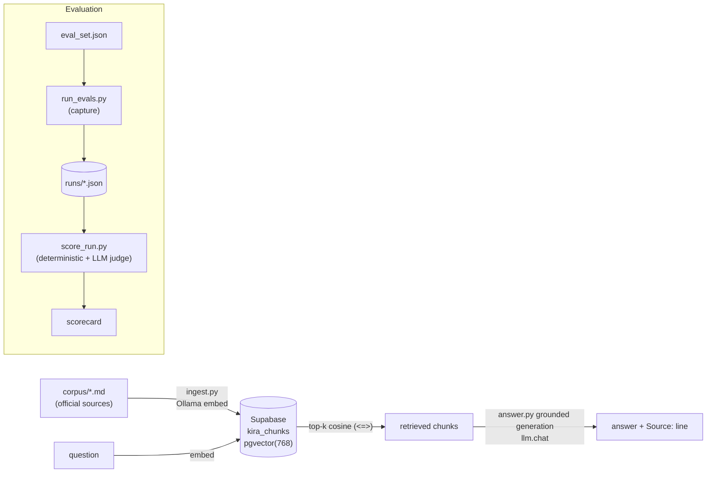

# Kira — Malaysian Statutory Payroll RAG

Kira is a small, dependency-light Retrieval-Augmented Generation (RAG) system that
answers questions about **Malaysian statutory payroll** — EPF (KWSP), SOCSO
(PERKESO), EIS, and PCB (Potongan Cukai Bulanan / Monthly Tax Deduction, LHDNM) —
**strictly from a curated corpus of official sources**.

It is deliberately conservative:

- **Grounded.** Answers use only the retrieved passages; it never draws on the
  model's own knowledge. If the corpus doesn't cover something, it says so.
- **Refuses to compute or advise.** It explains how a scheme works but declines to
  calculate a person's exact figure or give personal tax/financial advice,
  redirecting to the official calculators (LHDN PCB Calculator, KWSP, PERKESO).
- **Cites its sources.** Every answer ends with a `Source:` line naming the
  official document label(s) it used.

These properties are enforced by the generation prompt and verified by an
evaluation harness (see [Evaluation](#evaluation)).

---

## Architecture



The pipeline is four stages: **chunk → embed → store → retrieve → generate**.
Embeddings are produced locally by Ollama (`nomic-embed-text`, 768-dim) and stored
in Postgres/pgvector on Supabase. Retrieval is cosine similarity via the `<=>`
operator. Generation and the eval judge call an LLM through a small multi-backend
client (`llm.py`) that speaks Groq, Gemini, or Ollama over plain HTTP.

---

## Repository layout

| Path | What it is |
|------|------------|
| `corpus/` | The knowledge base: `epf.md`, `socso.md`, `eis.md`, `pcb.md`. Each rate/rule is a plain-language paragraph; the first `Source:` line becomes the citation label. |
| `ingest.py` | Reads `corpus/*.md`, splits on blank-line paragraphs, embeds each chunk (Ollama), and inserts rows into the `kira_chunks` table. |
| `search.py` | Retrieval only: embeds a query and returns the top-k chunks by pgvector cosine similarity. No LLM call. |
| `answer.py` | Grounded generation: retrieves, then asks the configured LLM to answer strictly from the chunks, following the refusal + citation rules. |
| `llm.py` | Multi-backend chat client (`groq` / `gemini` / `ollama`) with retry, `Retry-After` handling, and role/config resolution. Shared by generation and the judge. |
| `evals/eval_set.json` | The fixed evaluation set (43 cases: factual, cross-language, out-of-scope, advice/calculation, adversarial). |
| `evals/run_evals.py` | Runs every case through the pipeline and saves a timestamped, checkpointed run to `evals/runs/`. Capture only — no scoring. |
| `evals/score_run.py` | Scores a saved run: deterministic checks + an LLM-as-judge, and prints a scorecard by type. |
| `scratch/pcb_full.md` | Provenance: the full pre-trim PCB guideline text that `corpus/pcb.md` (concepts-only) was derived from. |
| `.env.example` | Template for all configuration. Copy to `.env` (git-ignored). |

---

## Prerequisites

- **Python 3.10+** with a virtualenv at `.venv`.
- **[Ollama](https://ollama.com)** running locally for embeddings, with the model pulled:
  `ollama pull nomic-embed-text`.
- **Supabase** (or any Postgres) with the **pgvector** extension. `ingest.py` creates
  the extension and `kira_chunks` table for you. Use the **Session pooler** connection
  string (works over IPv4; the direct `db.<ref>.supabase.co` host is IPv6-only).
- An **LLM API key** for generation and the judge — a free **Groq** key is the default
  (`https://console.groq.com/keys`). Gemini and local Ollama chat models are also supported.

---

## Setup

```bash
# 1. Configure
cp .env.example .env          # then fill in the values (see Configuration below)

# 2. Install dependencies
python3 -m venv .venv
./.venv/bin/pip install -r requirements.txt

# 3. Embeddings model
ollama pull nomic-embed-text

# 4. Build the index (creates the extension + table, embeds, inserts)
./.venv/bin/python ingest.py
#   ./.venv/bin/python ingest.py --reset   # re-ingest from scratch
```

## Usage

```bash
# Retrieval only — inspect what the retriever returns
./.venv/bin/python search.py "what is the employer EPF contribution rate?"

# Grounded answer (uses GEN_BACKEND, default groq)
./.venv/bin/python answer.py "how much does an employer contribute to EPF?"

# See the prompt without calling the model
./.venv/bin/python answer.py --dry-run "compute my PCB on RM6000 salary"

# Override the backend for one run
GEN_BACKEND=gemini ./.venv/bin/python answer.py "..."
```

Example of the two guardrails in action:

- *"What is the SOCSO rate for an employee under 60?"* → states the rates, ends with
  `Source: PERKESO — Contributions`.
- *"Calculate my PCB on RM6,000 with two kids."* → *"I can explain how PCB works, but I
  can't calculate your exact figure…"* and points to the LHDN PCB Calculator.

---

## Configuration

All configuration lives in `.env` (never committed). See `.env.example` for the full,
annotated template. Key variables:

| Variable | Purpose |
|----------|---------|
| `SUPABASE_DB_URL` | Full Postgres connection string (Session pooler URI). Or set the `SUPABASE_DB_HOST/_PORT/_NAME/_USER/_PASSWORD` parts individually. |
| `OLLAMA_URL`, `OLLAMA_MODEL` | Ollama endpoint and embedding model (defaults: `http://localhost:11434`, `nomic-embed-text`). |
| `GEN_BACKEND`, `GEN_MODEL` | Generation backend (`groq` \| `gemini` \| `ollama`, default `groq`) and optional model override. |
| `JUDGE_BACKEND`, `JUDGE_MODEL` | Eval-judge backend and optional model override (default `groq`). |
| `GROQ_API_KEY`, `GROQ_MODEL` | Groq key and default Groq model (`llama-3.3-70b-versatile`). |
| `GEMINI_API_KEY`, `GEMINI_MODEL` | Only needed if a backend is set to `gemini`. |

> **Keep generation and the judge on different models.** If both use the same model,
> the judge grades its own output (self-preference bias). The defaults ship with
> generation on `llama-3.3-70b-versatile` and the judge on a different Groq model.

---

## The corpus

Four markdown files, one per scheme, derived from official sources. Each contribution
rate is written as a complete plain-language sentence, each rule/FAQ is its own
blank-line-separated paragraph, and there are no HTML tables. The `scheme` is derived
from the filename; the `source_label` (the short citation shown to users) comes from
the first `Source:` line.

`corpus/pcb.md` is intentionally a **concepts-only** rendering: formulas, rate
schedules, and worked calculations were removed because the system explains PCB
concepts and refuses to compute deductions. The untrimmed original is preserved at
`scratch/pcb_full.md` for provenance.

To change the knowledge base, edit `corpus/*.md` and re-run `ingest.py --reset`.

---

## Evaluation

The harness makes the system's behavior measurable and keeps the scorecard
trustworthy. It is split into **capture** and **scoring** so generation is run once
and can be scored (and re-scored) without touching the model again.

```bash
# 1. Capture: run every eval case, save a timestamped run under evals/runs/
./.venv/bin/python evals/run_evals.py                 # add --delay 8 to pace free tiers
./.venv/bin/python evals/run_evals.py --resume evals/runs/run_XXewXX.json   # continue a partial run

# 2. Score: deterministic checks + LLM judge, printed by type
./.venv/bin/python evals/score_run.py                 # newest run
./.venv/bin/python evals/score_run.py --no-judge      # deterministic only, zero API calls
```

**Deterministic checks (no LLM):** citation correctness (cited `source_label` vs
expected), forbidden-fact violations, retrieval recall@k (did the gold chunk appear in
top-k), facts-present, refusal correctness (does the refusal wording match the expected
type), and **false-refusal** detection. A false refusal — an answerable case the system
refused anyway — is owned entirely by this layer (the judge can't see it) and scored 0.

**LLM judge:** grades only cases where the system actually *attempted* an answer, on a
0/1/2 rubric, judging support-by-retrieved-chunks (not the judge's own knowledge).

The scorecard reports, per type and overall: mean accuracy, retrieval recall@k, refusal
correctness, false-refusal rate, and forbidden violations, then highlights seeded
failures and any places the deterministic facts check disagrees with the judge.

**Free-tier resilience.** Both scripts pace requests, honor `Retry-After` on HTTP 429,
checkpoint after every step, and resume from where they stopped — so a daily/token cap
never loses work. `run_evals.py` resumes with `--resume`; `score_run.py` resumes from a
per-run `*.judge.json` sidecar cache automatically.

---

## Known limitations

- **Retrieval recall.** `nomic-embed-text` is trained with `search_query:` /
  `search_document:` task prefixes, which the current ingest/search do not apply.
  Some exact-rate rows therefore rank just outside top-k (visible as recall misses and
  seeded failures in the scorecard). Adding the prefixes and re-ingesting would improve
  recall.
- **Generator guardrail sensitivity.** On some backends the model over-applies the
  "I can't calculate your exact figure" guardrail to plain factual rate questions
  ("what's the SOCSO rate"), refusing instead of answering. This is visible in the eval
  output and depends on the chosen `GEN_BACKEND`/`GEN_MODEL`.

---

## Security notes

- `.env` holds the database password and API keys and is git-ignored — never commit it.
- API keys are read from the environment and sent in request headers, never hard-coded
  or placed in URLs.
